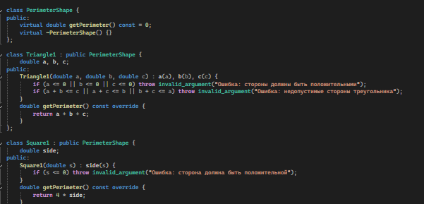

<head>
    <title>Список задач</title>
</head>
<body>
    <h1>Список задач</h1>
    

        <!-- Задачи 1-40 с картинками 1-40 -->
        

            <h2>Задача 1</h2>
            
Создайте базовый класс `Shape` с виртуальной функцией `area()`. Реализуйте производные классы `Circle` и `Rectangle`, которые выбрасывают исключение при некорректных параметрах.

            
        

        

            <h2>Задача 2</h2>
            
Реализуйте класс `Animal` с виртуальной функцией `speak()`. Создайте классы `Dog` и `Cat`, которые выбрасывают исключение, если их имя пустое.

            
        

        

            <h2>Задача 3</h2>
            
Создайте класс `BankAccount` с виртуальной функцией `withdraw()`, которая выбрасывает исключение при недостаточном балансе. Реализуйте производные классы `SavingsAccount` и `CheckingAccount`.

            
        

        

            <h2>Задача 4</h2>
            
Напишите базовый класс `FileHandler` с виртуальной функцией `open()`, которая выбрасывает исключение, если файл не найден. Реализуйте классы `TextFileHandler` и `BinaryFileHandler`.

            
        

        

            <h2>Задача 5</h2>
            
Создайте класс `Shape` с виртуальной функцией `draw()`, которая выбрасывает исключение при некорректных параметрах. Реализуйте классы `Triangle` и `Square`.

            
        

        

            <h2>Задача 6</h2>
            
Реализуйте класс `Person` с виртуальной функцией `display()`, которая выбрасывает исключение при некорректных данных. Создайте производные классы `Student` и `Teacher`.

            
        

        

            <h2>Задача 7</h2>
            
Создайте класс `Calculator` с виртуальной функцией `calculate()`, которая выбрасывает исключение при делении на ноль. Реализуйте классы `Addition` и `Division`.

            
        

        

            <h2>Задача 8</h2>
            
Напишите базовый класс `Game` с виртуальной функцией `start()`, которая выбрасывает исключение, если игра не может начаться. Реализуйте классы `Chess` и `Tennis`.

            
        

        

            <h2>Задача 9</h2>
            
Создайте класс `Document` с виртуальной функцией `save()`, которая выбрасывает исключение при ошибке сохранения. Реализуйте классы `PDFDocument` и `WordDocument`.

            
        

        

            <h2>Задача 10</h2>
            
Реализуйте класс `Matrix` с виртуальной функцией `getElement()`, которая выбрасывает исключение при выходе за границы. Создайте производные классы `IntMatrix` и `FloatMatrix`.

            
        

        

            <h2>Задача 11</h2>
            
Создайте класс `Vehicle` с виртуальной функцией `fuelEfficiency()`, которая выбрасывает исключение при некорректных данных. Реализуйте классы `Car` и `Truck`.

            
        

        

            <h2>Задача 12</h2>
            
Реализуйте класс `User` с виртуальной функцией `login()`, которая выбрасывает исключение при неверном пароле. Создайте производные классы `AdminUser` и `RegularUser`.

            
        

        

            <h2>Задача 13</h2>
            
Напишите базовый класс `Shape` с виртуальной функцией `scale()`, которая выбрасывает исключение при отрицательном масштабе. Реализуйте классы `Circle` и `Square`.

            
        

        

            <h2>Задача 14</h2>
            
Создайте класс `Library` с виртуальной функцией `borrowBook()`, которая выбрасывает исключение, если книга недоступна. Реализуйте классы `FictionLibrary` и `NonFictionLibrary`.

            
        

        

            <h2>Задача 15</h2>
            
Реализуйте класс `Order` с виртуальной функцией `process()`, которая выбрасывает исключение при некорректных данных. Создайте производные классы `OnlineOrder` и `InStoreOrder`.

            
        

        

            <h2>Задача 16</h2>
            
Создайте класс `Shape` с виртуальной функцией `rotate()`, которая выбрасывает исключение при некорректных углах. Реализуйте классы `Triangle` и `Rectangle`.

            
        

        

            <h2>Задача 17</h2>
            
Реализуйте класс `Payment` с виртуальной функцией `processPayment()`, которая выбрасывает исключение при недостаточном балансе. Создайте классы `CreditCardPayment` и `PayPalPayment`.

            
        

        

            <h2>Задача 18</h2>
            
Напишите базовый класс `ExceptionHandler` с виртуальной функцией `handle()`, которая выбрасывает исключение при ошибке. Реализуйте классы `FileExceptionHandler` и `NetworkExceptionHandler`.

            
        

        

            <h2>Задача 19</h2>
            
Создайте класс `Course` с виртуальной функцией `enroll()`, которая выбрасывает исключение при переполнении группы. Реализуйте классы `OnlineCourse` и `OfflineCourse`.

            
        

        

            <h2>Задача 20</h2>
            
Реализуйте класс `ShoppingCart` с виртуальной функцией `checkout()`, которая выбрасывает исключение при пустой корзине. Создайте классы `RegularCart` и `DiscountedCart`.

            
        

        

            <h2>Задача 21</h2>
            
Создайте класс `Vehicle` с виртуальной функцией `fuelEfficiency()`, которая выбрасывает исключение при некорректных данных. Реализуйте классы `Car` и `Truck`.

            
        

        

            <h2>Задача 22</h2>
            
Реализуйте класс `User` с виртуальной функцией `login()`, которая выбрасывает исключение при неверном пароле. Создайте производные классы `AdminUser` и `RegularUser`.

            
        

        

            <h2>Задача 23</h2>
            
Напишите базовый класс `Shape` с виртуальной функцией `scale()`, которая выбрасывает исключение при отрицательном масштабе. Реализуйте классы `Circle` и `Square`.

            
        

        

            <h2>Задача 24</h2>
            
Создайте класс `Library` с виртуальной функцией `borrowBook()`, которая выбрасывает исключение, если книга недоступна. Реализуйте классы `FictionLibrary` и `NonFictionLibrary`.

            
        

        

            <h2>Задача 25</h2>
            
Реализуйте класс `Order` с виртуальной функцией `process()`, которая выбрасывает исключение при некорректных данных заказа. Создайте производные классы `OnlineOrder` и `InStoreOrder`.

            
        

        

            <h2>Задача 26</h2>
            
Создайте класс `Shape` с виртуальной функцией `rotate()`, которая выбрасывает исключение при некорректных углах. Реализуйте классы `Triangle` и `Rectangle`.

            
        

        

            <h2>Задача 27</h2>
            
Реализуйте класс `Payment` с виртуальной функцией `processPayment()`, которая выбрасывает исключение при недостаточном балансе. Создайте классы `CreditCardPayment` и `PayPalPayment`.

            
        

        

            <h2>Задача 28</h2>
            
Напишите базовый класс `ExceptionHandler` с виртуальной функцией `handle()`, которая выбрасывает исключение при ошибке. Реализуйте классы `FileExceptionHandler` и `NetworkExceptionHandler`.

            
        

        

            <h2>Задача 29</h2>
            
Создайте класс `Course` с виртуальной функцией `enroll()`, которая выбрасывает исключение при переполнении группы. Реализуйте классы `OnlineCourse` и `OfflineCourse`.

            
        

        

            <h2>Задача 30</h2>
            
Реализуйте класс `ShoppingCart` с виртуальной функцией `checkout()`, которая выбрасывает исключение при пустой корзине. Создайте классы `RegularCart` и `DiscountedCart`.

            
        

        

            <h2>Задача 31</h2>
            
Создайте класс `Shape` с виртуальной функцией `translate()`, которая выбрасывает исключение при недопустимых координатах. Реализуйте классы `Circle` и `Rectangle`.

            
        

        

            <h2>Задача 32</h2>
            
Реализуйте класс `Database` с виртуальной функцией `connect()`, которая выбрасывает исключение при ошибке подключения. Создайте классы `MySQLDatabase` и `SQLiteDatabase`.

            
        

        

            <h2>Задача 33</h2>
            
Создайте класс `Task` с виртуальной функцией `execute()`, которая выбрасывает исключение при неинициализированной задаче. Реализуйте классы `PrintTask` и `EmailTask`.

            
        

        

            <h2>Задача 34</h2>
            
Напишите базовый класс `Shape` с виртуальной функцией `getPerimeter()`, которая выбрасывает исключение при некорректных параметрах. Реализуйте классы `Triangle` и `Square`.

            
        

        

            <h2>Задача 35</h2>
            
Реализуйте класс `WeatherService` с виртуальной функцией `getForecast()`, которая выбрасывает исключение при недоступности данных. Создайте классы `LocalWeatherService` и `RemoteWeatherService`.

            
        

        

            <h2>Задача 36</h2>
            
Создайте класс `Transaction` с виртуальной функцией `commit()`, которая выбрасывает исключение при ошибке выполнения. Реализуйте классы `BankTransaction` и `CryptoTransaction`.

            
        

        

            <h2>Задача 37</h2>
            
Реализуйте класс `Notification` с виртуальной функцией `send()`, которая выбрасывает исключение при ошибке отправки. Создайте классы `EmailNotification` и `SMSNotification`.

            
        

        

            <h2>Задача 38</h2>
            
Напишите базовый класс `Shape` с виртуальной функцией `getBoundingBox()`, которая выбрасывает исключение при некорректных параметрах. Реализуйте классы `Circle` и `Polygon`.

            
        

        

            <h2>Задача 39</h2>
            
Создайте класс `UserProfile` с виртуальной функцией `updateProfile()`, которая выбрасывает исключение при некорректных данных. Реализуйте классы `AdminProfile` и `GuestProfile`.

            
        

        

            <h2>Задача 40</h2>
            
Реализуйте класс `PaymentProcessor` с виртуальной функцией `processPayment()`, которая выбрасывает исключение при недостаточном балансе. Создайте классы `CreditCardProcessor` и `DebitCardProcessor`.

            
        

        <!-- Задачи 41-50 с случайными картинками -->
        

            <h2>Задача 41</h2>
            
Создайте класс `Shape` с виртуальной функцией `reflect()`, которая выбрасывает исключение при некорректных параметрах. Реализуйте классы `Circle` и `Rectangle`.

            
        

        

            <h2>Задача 42</h2>
            
Реализуйте класс `FileReader` с виртуальной функцией `read()`, которая выбрасывает исключение при ошибке чтения. Создайте классы `TextFileReader` и `BinaryFileReader`.

            
        

        

            <h2>Задача 43</h2>
            
Напишите базовый класс `Shape` с виртуальной функцией `getArea()`, которая выбрасывает исключение при некорректных параметрах. Реализуйте классы `Ellipse` и `Square`.

            
        

        

            <h2>Задача 44</h2>
            
Создайте класс `EmailService` с виртуальной функцией `sendEmail()`, которая выбрасывает исключение при ошибке отправки. Реализуйте классы `SMTPService` и `APIService`.

            
        

        

            <h2>Задача 45</h2>
            
Реализуйте класс `Game` с виртуальной функцией `endGame()`, которая выбрасывает исключение при завершении неактивной игры. Создайте классы `ChessGame` и `FootballGame`.

            
        

        

            <h2>Задача 46</h2>
            
Создайте класс `Shape` с виртуальной функцией `getVertices()`, которая выбрасывает исключение при некорректных параметрах. Реализуйте классы `Triangle` и `Pentagon`.

            
        

        

            <h2>Задача 47</h2>
            
Реализуйте класс `Session` с виртуальной функцией `startSession()`, которая выбрасывает исключение при повторном запуске. Создайте классы `UserSession` и `AdminSession`.

            
        

        

            <h2>Задача 48</h2>
            
Напишите базовый класс `Shape` с виртуальной функцией `getColor()`, которая выбрасывает исключение при некорректных параметрах. Реализуйте классы `Circle` и `Square`.

            
        

        

            <h2>Задача 49</h2>
            
Создайте класс `Logger` с виртуальной функцией `log()`, которая выбрасывает исключение при ошибке записи. Реализуйте классы `FileLogger` и `ConsoleLogger`.

            
        

        

            <h2>Задача 50</h2>
            
Реализуйте класс `DataProcessor` с виртуальной функцией `processData()`, которая выбрасывает исключение при некорректных данных. Создайте классы `CSVProcessor` и `JSONProcessor`.

            
        

        <!-- Задачи 51-60 с картинками 1-10 -->
        

            <h2>Задача 51</h2>
            
Создайте абстрактный класс `Shape` с чисто виртуальной функцией `area()`, которая выбрасывает исключение при некорректных параметрах. Реализуйте классы `Circle`, `Rectangle` и `Triangle`.

            
        

        

            <h2>Задача 52</h2>
            
Реализуйте класс `Employee` с виртуальной функцией `calculateSalary()`, которая выбрасывает исключение при отрицательных часах. Создайте классы `FullTimeEmployee` и `PartTimeEmployee`.

            
        

        

            <h2>Задача 53</h2>
            
Создайте класс `DataReader` с виртуальной функцией `readData()`, которая выбрасывает исключение при ошибке чтения. Реализуйте классы `CSVReader` и `XMLReader`.

            
        

        

            <h2>Задача 54</h2>
            
Напишите базовый класс `Shape` с виртуальной функцией `scale()`, которая выбрасывает исключение при отрицательном масштабе. Реализуйте классы `Circle`, `Square` и `Polygon`.

            
        

        

            <h2>Задача 55</h2>
            
Создайте класс `BankAccount` с виртуальной функцией `transfer()`, которая выбрасывает исключение при недостатке средств. Реализуйте классы `SavingsAccount` и `CheckingAccount`.

            
        

        

            <h2>Задача 56</h2>
            
Реализуйте класс `NetworkRequest` с виртуальной функцией `send()`, которая выбрасывает исключение при ошибке сети. Создайте классы `HttpRequest` и `FtpRequest`.

            
        

        

            <h2>Задача 57</h2>
            
Создайте класс `Shape` с виртуальной функцией `getBoundingBox()`, которая выбрасывает исключение при некорректных параметрах. Реализуйте классы `Circle`, `Rectangle` и `Polygon`.

            
        

        

            <h2>Задача 58</h2>
            
Напишите базовый класс `Exception` с виртуальной функцией `what()`. Создайте классы `FileNotFoundException`, `InvalidInputException` и `NetworkException`.

            
        

        

            <h2>Задача 59</h2>
            
Создайте класс `Task` с виртуальной функцией `execute()`, которая выбрасывает исключение при неинициализированной задаче. Реализуйте классы `PrintTask`, `EmailTask` и `DatabaseTask`.

            
        

        

            <h2>Задача 60</h2>
            
Реализуйте класс `Shape` с виртуальной функцией `rotate()`, которая выбрасывает исключение при некорректных углах. Создайте классы `Circle`, `Square` и `Triangle`.

            
        

        <!-- Задачи 61-70 с картинками 11-20 -->
        

            <h2>Задача 61</h2>
            
Создайте класс `Notification` с виртуальной функцией `send()`, которая выбрасывает исключение при ошибке отправки. Реализуйте классы `EmailNotification`, `SMSNotification` и `PushNotification`.

            
        

        

            <h2>Задача 62</h2>
            
Реализуйте класс `Shape` с виртуальной функцией `getPerimeter()`, которая выбрасывает исключение при некорректных параметрах. Создайте классы `Circle`, `Rectangle` и `Triangle`.

            
        

        

            <h2>Задача 63</h2>
            
Создайте класс `Session` с виртуальной функцией `start()`, которая выбрасывает исключение при повторном запуске. Реализуйте классы `UserSession` и `AdminSession`.

            
        

        

            <h2>Задача 64</h2>
            
Напишите базовый класс `DataProcessor` с виртуальной функцией `process()`, которая выбрасывает исключение при некорректных данных. Реализуйте классы `CSVProcessor`, `JSONProcessor` и `XMLProcessor`.

            
        

        

            <h2>Задача 65</h2>
            
Создайте класс `Shape` с виртуальной функцией `transform()`, которая выбрасывает исключение при некорректных параметрах. Реализуйте классы `Circle`, `Square` и `Polygon`.

            
        

        

            <h2>Задача 66</h2>
            
Реализуйте класс `User` с виртуальной функцией `updateProfile()`, которая выбрасывает исключение при некорректных данных. Создайте классы `AdminUser` и `RegularUser`.

            
        

        

            <h2>Задача 67</h2>
            
Создайте класс `TaskManager` с виртуальной функцией `runTask()`, которая выбрасывает исключение при ошибке выполнения. Реализуйте классы `ScheduledTask` и `ImmediateTask`.

            
        

        

            <h2>Задача 68</h2>
            
Напишите базовый класс `Shape` с виртуальной функцией `getColor()`, которая выбрасывает исключение при некорректных параметрах. Реализуйте классы `Circle`, `Square` и `Triangle`.

            
        

        

            <h2>Задача 69</h2>
            
Создайте класс `PaymentGateway` с виртуальной функцией `processPayment()`, которая выбрасывает исключение при ошибке платежа. Реализуйте классы `StripeGateway`, `PayPalGateway` и `SquareGateway`.

            
        

        

            <h2>Задача 70</h2>
            
Реализуйте класс `FileReader` с виртуальной функцией `read()`, которая выбрасывает исключение при ошибке чтения. Создайте классы `TextFileReader`, `BinaryFileReader` и `JsonFileReader`.

            
        

        <!-- Задачи 71-80 с картинками 50-60 -->
        

            <h2>Задача 75</h2>
            
Создайте класс `Shape` с виртуальной функцией `getArea()`, которая выбрасывает исключение при некорректных параметрах. Реализуйте классы `Circle`, `Rectangle` и `Triangle`.

            
        

        

            <h2>Задача 76</h2>
            
Напишите базовый класс `ExceptionHandler` с виртуальной функцией `handle()`, которая выбрасывает исключение при ошибке. Реализуйте классы `FileExceptionHandler`, `NetworkExceptionHandler` и `InputExceptionHandler`.

            
        

        

            <h2>Задача 77</h2>
            
Создайте класс `UserProfile` с виртуальной функцией `save()`, которая выбрасывает исключение при ошибке сохранения. Реализуйте классы `AdminProfile` и `RegularProfile`.

            
        

        

            <h2>Задача 78</h2>
            
Реализуйте класс `Shape` с виртуальной функцией `getDescription()`, которая выбрасывает исключение при некорректных параметрах. Создайте классы `Circle`, `Square` и `Triangle`.

            
        

        

            <h2>Задача 79</h2>
            
Создайте класс `EmailService` с виртуальной функцией `sendEmail()`, которая выбрасывает исключение при ошибке отправки. Реализуйте классы `SMTPService`, `APIService` и `MockEmailService`.

            
        

        

            <h2>Задача 80</h2>
            
Напишите базовый класс `DataValidator` с виртуальной функцией `validate()`, которая выбрасывает исключение при некорректных данных. Реализуйте классы `EmailValidator`, `PhoneValidator` и `AgeValidator`.

            <img src="screenshots/59.png" alt="Иллюстрация к зада
